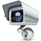

#  Vera-Plugin-SurveillanceStationRemote

Remote for [Synology Surveillance Station](https://www.synology.com/en-uk/surveillance/)

 

Designed for [Vera Control, Ltd.](http://getvera.com/) Home Controllers. This plugin is able to enable/disable surveillance station and to start/stop external record.

 

**Compatible with UI5 & UI7 / VeraPlus, VeraEdge, Vera3, VeraLite / openLuup**

More informations here (in French) : http://www.touteladomotique.com/forum/viewtopic.php?f=48&t=16306
